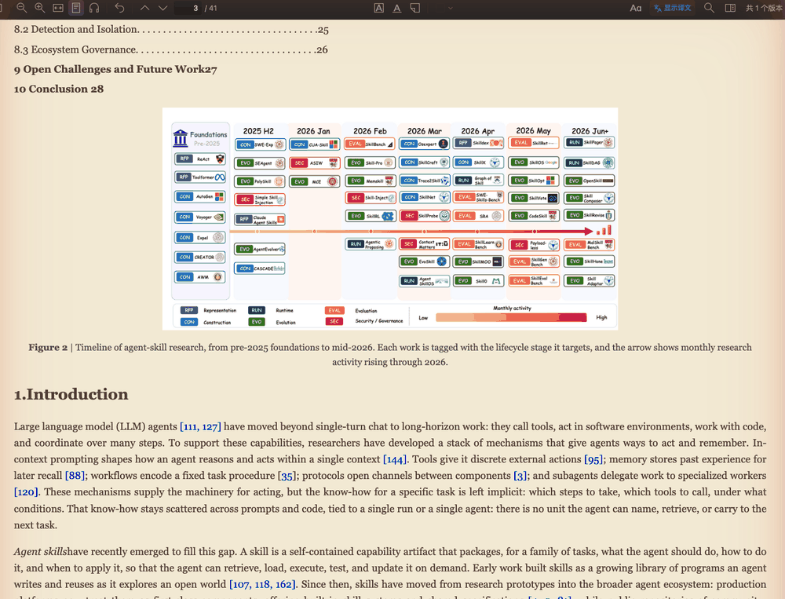
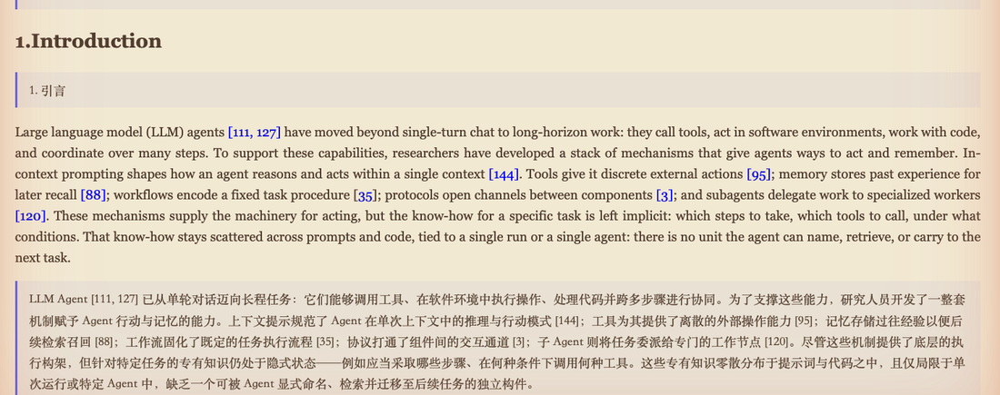
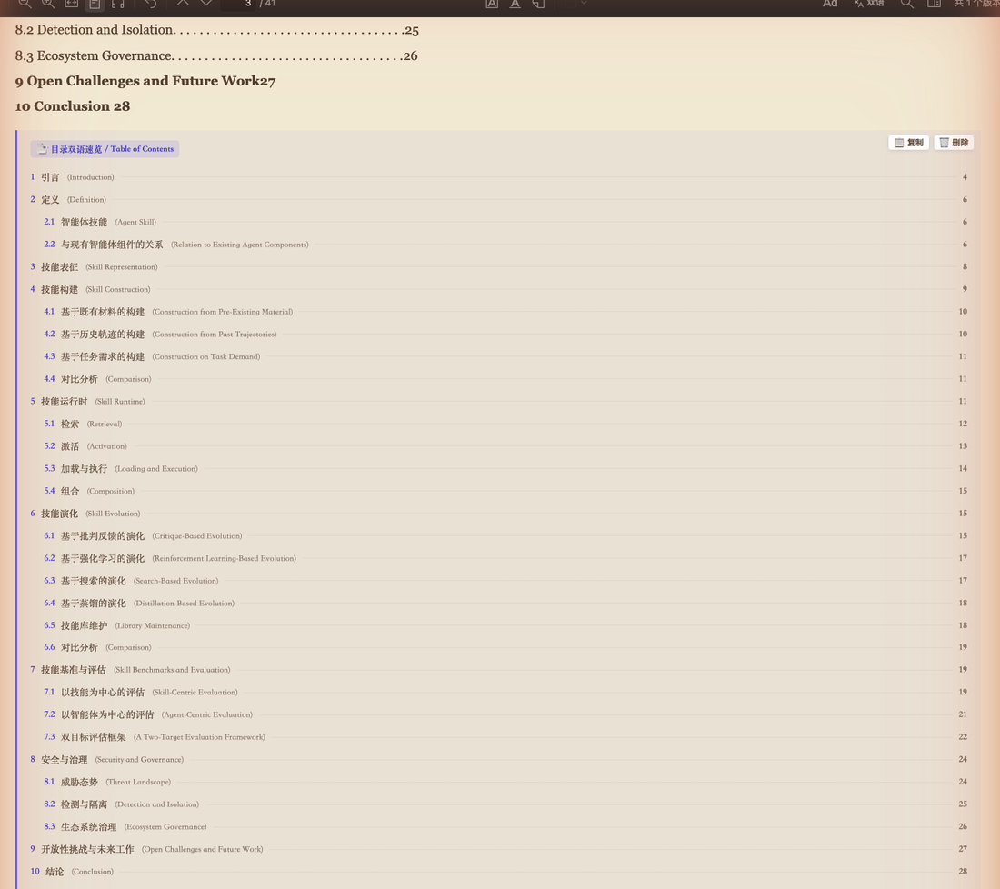
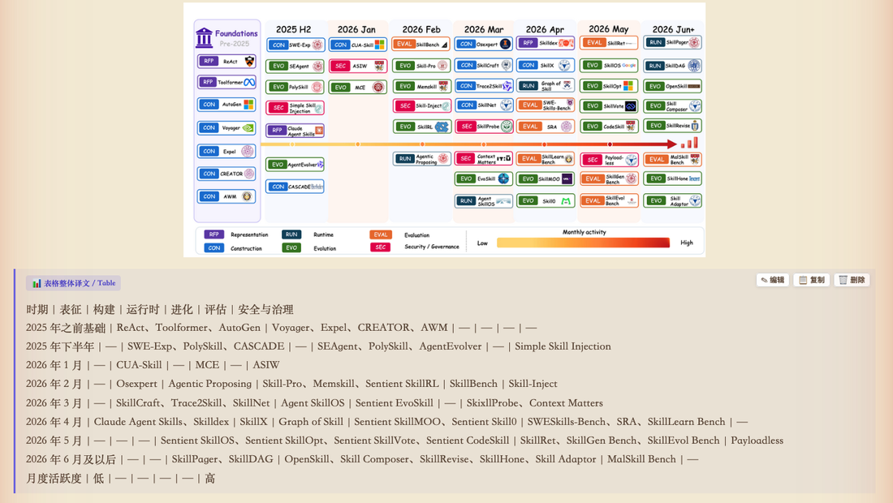
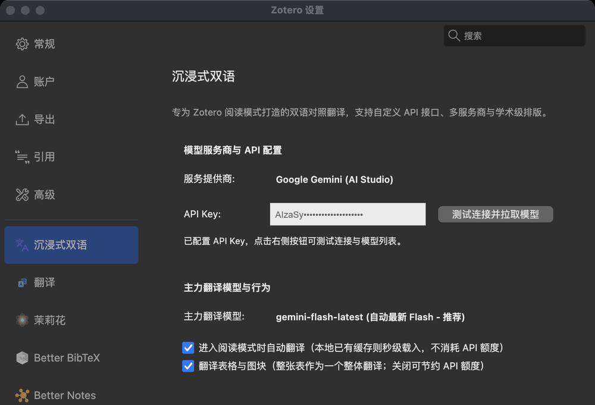

# Zotero 阅读模式沉浸式双语

专为 Zotero 阅读模式打造的中英双语对照翻译插件。译文以卡片形式插在原文段落之下，原文保持不动。

 



> 点击工具栏的「双语」按钮即可在原文与双语对照之间切换。

## 效果

**段落对照**：译文卡片插在原文之下，原文一个字都不动。



**目录整体翻译**：整页目录合成一张卡片，保留章节号、原标题与页码，跨页断开的目录会自动合并。



**表格整体翻译**：阅读模式把 PDF 表格渲染成图片、文字藏在隐藏节点里，插件把整张表当一个单元翻译并还原成分行分列的中文。



**设置**：Zotero 设置 → 沉浸式双语。



## 功能

- **段落级对照**：正文按段成批翻译，译文卡片插在原文下方，可编辑、复制、单独删除。
- **目录整体翻译**：把整页目录识别成一个单元翻译成一张卡片，跨页断开的目录会自动合并，不会被切成几十条碎片。
- **表格整体翻译**：阅读模式把 PDF 表格渲染成图片、文字藏在隐藏节点里，插件会把整张表当一个单元翻译并还原成分行分列的中文。此项可在设置中关闭以节约额度。
- **并发翻译**：默认同时发出 3 个请求，可在设置中调到 1 到 8。长文献从逐个请求改为并发后耗时大幅下降；调太高会触发服务商限流，失败的段落再点一次按钮即可补翻。
- **断点续翻**：每批译完立即写入缓存，中途关标签页、退出 Zotero 或断网都不会丢掉已经翻好的部分。再次点击「双语」只会补翻缺失和失败的段落，已完成的不会重复消耗额度。
- **阅读模式默认外观**：Zotero 自身没有页宽与字号的默认值设置，每篇文献打开都会回到 75%。插件可以代为设定，每篇文献进入阅读模式时应用一次。
- **跳过参考文献**：自动识别参考文献章节并跳过，不浪费额度。
- **本地缓存**：译文以 `<文献名>.bilingual.json` 存在附件同目录，重开秒级载入，不重复消耗 API。
- **多服务商**：Gemini、DeepSeek、SiliconFlow、OpenRouter、Moonshot、Qwen、OpenAI，以及任意 OpenAI 兼容接口。
- **排版可调**：字体、字号、行高、主题色、卡片底色、边栏线条样式。

## 安装

1. 从 [Releases](https://github.com/tianlrz/zotero-reading-bilingual/releases) 下载 `zotero-reading-bilingual.xpi`。
2. Zotero 菜单：工具 → 插件 → 右上角齿轮 → Install Plugin From File，选择该 xpi。
3. 打开一篇文献，**切换到阅读模式**，点击工具栏的「双语」按钮。

> 插件只在阅读模式下工作。PDF 原始视图没有可供插入译文的段落结构，按钮不会有反应。阅读模式的开关在阅读器工具栏上。

## 配置

Zotero 设置 → 沉浸式双语。

插件**不自带任何 API Key**，需要自己填写。Gemini 可在 Google AI Studio 免费申请。填好后点「测试连接」拉取可用模型列表。

其余选项：主力模型、进入阅读模式时自动翻译、翻译表格与图块、并发请求数、阅读模式默认页宽与字号、排版样式、自定义翻译提示词。

关于并发请求数：默认 3 是速度与稳定的折中。免费额度的 Gemini 建议不超过 3，付费或高速率上限的接口可以调到 5 到 8。如果看到大量「[翻译失败: HTTP 429]」，说明超过了服务商的速率上限，调低即可，已经翻好的部分不会丢。

## 快捷操作

- 工具栏「双语」按钮：翻译 / 显示 / 隐藏译文
- Shift 或 Alt + 点击该按钮：清空缓存并重新翻译
- 右键该按钮：更多操作
- 正文中选中文本右键：只翻译选中部分

## 阅读模式默认页宽与字号

Zotero 的阅读模式「外观」面板里可以调页宽和字号，但这两个值只对当前打开的文献生效，关掉再开就回到内置默认的 75%。Zotero 没有提供对应的偏好设置，默认值写死在阅读器内部。

插件在设置里补了这两项：

- **默认页宽**：不修改 / 50% / 75% / 100%
- **默认字号**：不修改 / 100% 到 250%

选定后，每篇文献进入阅读模式时插件会应用一次。**之后你在「外观」面板里手动改动不会被抢回去**，当次阅读一直保持你手调的值。两项默认都是「不修改」，不设就完全不碰 Zotero 的行为。

## 关于云同步

译文缓存 `<文献名>.bilingual.json` 与附件同目录，是否会跟随 Zotero 同步取决于同步方式：

| 同步方式 | 附件类型 | 缓存是否上传 |
|---|---|---|
| Zotero 官方存储 | PDF / EPUB | 否，只上传附件本体 |
| Zotero 官方存储 | 网页快照 | 是，整个目录打包上传 |
| WebDAV（坚果云等） | 任意 | 是，WebDAV 一律整目录打包 |

两点需要注意：

1. Zotero 判断附件「是否有改动」只看附件本体的修改时间与哈希，不看目录里的其他文件。所以只有译文缓存变化时不会触发上传，缓存往往不会自动同步到另一台设备。
2. 从云端下载附件时 Zotero 会先清空该附件目录再解压，本地的译文缓存会被一并删除。重要的译文建议先用卡片上的「复制」按钮导出。

## 已知限制

- 仅支持阅读模式，不支持 PDF 原始视图与网页快照。
- 表格文字在阅读模式中已被拉平为一行，还原出的行列结构依赖模型推断，复杂表格可能不完全准确。
- 目录识别基于「章节号 + 标题 + 页码」的排版特征，非常规排版的目录可能识别不到，会退回逐条翻译。

## 开发

无需构建步骤，仓库结构即插件结构。打包：

```bash
zip -r -X zotero-reading-bilingual.xpi manifest.json bootstrap.js prefs.js content
```

## License

MIT
